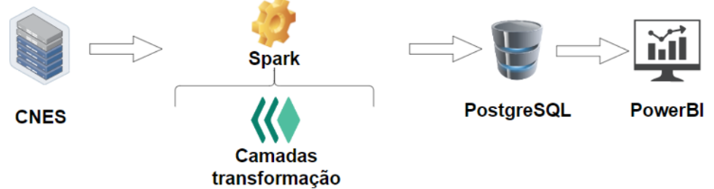
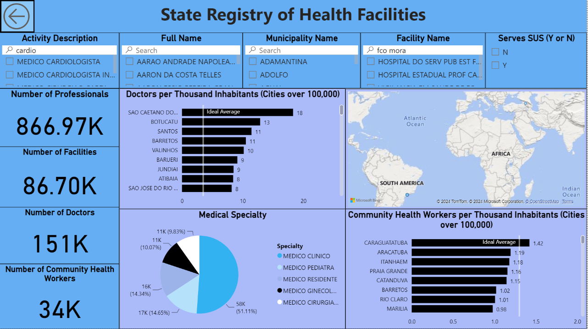

# São Paulo Healthcare Establishments Dashboard

## Overview

This project focuses on building a robust data pipeline responsible for feeding a PostgreSQL database, serving as the primary data source for the PowerBI dashboard. The aim is to provide comprehensive insights into healthcare establishments across São Paulo state, leveraging data from the CNES (Cadastro Nacional de Estabelecimentos de Saúde).

## Pipeline Components

### Data Source
- **Source:** FTP Server of CNES (Cadastro Nacional de Estabelecimentos de Saúde)
- **Data Ingestion:** Automated extraction of data from the CNES database using Spark engine.

### Data Processing
- **Engine:** Spark Engine
- **Processing:** Transformation and cleaning of raw data from CNES to create refined datasets.
- **Storage:** PostgreSQL database for storing the processed data.

### Visualization
- **Tool:** PowerBI
- **Dashboard:** Visual representations and insights derived from the PostgreSQL database to create an intuitive dashboard.

## Architecture Overview

## Dashboard Snapshot

## Project Structure

- **`/data_pipeline.py`**: Contains scripts and code for the Spark-based data processing pipeline.
- **`/postgresql`**: Includes sql files used such some ddl scripts and inserts.

## Usage

1. **Pipeline Setup**:
   - Clone the repository.
   - Set up the Spark-based pipeline for data processing.
   - Configure PostgreSQL database connection details.

## Contributions
Contributions to this project are welcomed. Feel free to fork the repository, make enhancements, and create pull requests.
